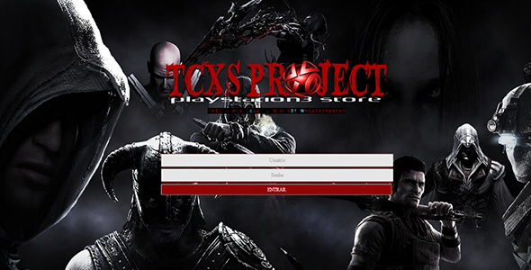

<h2 align="center">TCXS Project Store | PlayStation3 | HAN | HEN | CFW</h2>
</img> 

- Primeiramente agradecemos por querer colaborar com nosso projeto, ter sua ajuda é super importante para nós.
Pedimos que somente realize sua doação após ler esta documentação e estar de acordo com a mesma.  
<a href="https://gorpo.github.io/TCXS-PROJECT-STORE-2020/">Leia a documentação aqui.</a> 

<h2 class="dark-text">Quem somos:</h2>
                            
 

                        

                            

                                
A TCXS Project é uma loja para o console PlayStation3 similar a PSN Store de seu console, as versões HAN, HEN e CFW estão disponíveis gratuitamente em nosso <a href="https://t.me/tcxsproject2">Grupo do Telegram</a>.O nosso diferencial é que além de nossos títulos serem grátis, temos jogos e emuladores que não foram lançados para o console PlayStation3 de forma oficial além dos jogos NO-HEN e NO-HAN que são iguais os comprados na PSN, mesmo que você remova seu exploit estes jogos seguirão funcionando normalmente em seu console, ou seja, você pode baixar os jogos que quiser e depois deixar seu console original, este formato é válido apenas para jogos de Playsation3, todos demais jogos convertidos não funcionam em consoles posteriormente deixados originais. Os jogos convertidos, traduzidos e distruibuidos pela TCXS Project são de PlayStation PSP, PlayStation1, PlayStation2, PlayStation3 e Emuladores variados, todos com download direto do servidor Dropbox que é mantido com as contribuições do qual este documento trata. Nossa loja funciona nos sistemas HAN | HEN | CFW. 

                            

<h2 >TCXS STORE PKG:</h2>
                        

    

A TCXS Project Store está disponível gratuitamente em nosso <a href="https://t.me/tcxsproject2">Grupo do Telegram</a>, nos formatos HAN, HEN e CFW, para ter sua loja não é necessário ser um colaborador, basta entar no grupo e fazer o download da loja.

<ol>
<li>Após entar no grupo digite "att" (sem aspas).</li>
<li>Nosso bot irá trazer os arquivos para download e instalação.</li>
<li>Os arquivos de instalação encontram-se também nos menus do bot, basta digitar /help</li>
<li>Veja o tutorial de instalação e uso que o bot fornecer.</li>
<li>Caso tenha maiores dúvidas consulte tutoriais do youtube de como instalar um pkg em seu sistema.</li>
<li>Não prestamos suporte para exploit e desbloqueio este suporte é na PSX-Place.</li>
<li>Os jogos distribuídos para não colaboradores são jogos da PSN e precisam de licenças (Raps').</li>
<li>Todos os meses damos Bundle's de jogos que são de uso dos colaboradores, fique de olho nas atualizações que sempre terá jogos novos.</li>
<li>Não damos suporte, pois para usuários não colaboradores é apenas fornecido o download de jogos e cremos que não se faz necessário ensinar alguem fazer um download!</li>
<li>Em caso de bugs na programação informe no grupo, caso tenha links PSN quebrados não detemos poder sobre o servidor da sony e com tempo a sony tende tirar os jogos do ár!</li>
<li>Nosso sistema não  não afeta em nada em seu console, apenas é injetada uma pasta em seu console contendo as imagens usadas na loja e os arquivos XML, todo este conteudo você mesmo pode conferir via FTP caso tenha acesso ou descompactando nosso PKG, não toleramos comentários dizendo que a TCXS bugou seu console, pois não modificamos nada no mesmo.</li>
</ol>

<section id="line4" class="section">
                        
          

                                <h2 class="dark-text">Store para Colaboradores <a href="#top">voltar ao topo</a>
</h2>
                            
     

                          

                            

                                
                                <h4>Jogos Atualizados</h4>
                                
Todos jogos para colaboradores já vem com seus updates e patches lançados, os de PlayStation3 não precisam de licenças, são como se você os tivesse comprado na PSN Store, constantemente estamos aumentando a quantidade de jogos em nossa loja com atualizações automáticas.

                            
                        
                            

                                
                                <h4>Jogos Traduzidos</h4>
                                
Graças a parceria com as mais renomadas comunidades de tradução de games a TCXS sempre está trazendo jogos traduzidos, dublados ou legendados, temos uma grande lista de jogos traduzidos disponíveis nas plataformas PS1, PS2 PS3 e até nos emuladores, e ai oque está esperando?

                            

                            

<h4>Praticidade no Download</h4>

Clicou baixou jogou! A TCXS é praticidade, chega de virar a internet atrás de jogos que não pegam e contém virus, com a TCXS você tem a praticidade dos jogos comprados pela PSN Store de forma livre sem gastar um real a mais e garantia anti-ban, são 4 anos na cena sem um caso de ban!

<i class="fa fa-exclamation-triangle"></i>A TCXS Project Store está disponível em nosso <a href="https://t.me/tcxsproject2">Grupo do Telegram</a>, nos formatos HAN, HEN e CFW, para ter seu acesso com login e senha ao nosso sistema para colaboradores basta realizar uma contribuição, os valores vão de R15,oo a R$30,oo, porém doando mais não te honera de algum bônus, apenas mostra seu interesse em que os serviços se mantenham no ár para seu uso, também mostra seu carinho pelo projeto e reconhecimento pelo nosso trabalho. 

Ao contribuir para o projeto você deverá entregar seu comprovante no privado de um de nossos administradores, ele te dará acesso com login e senha em nosso sistema de download de jogos, neste sistema temos jogos de Playstation PSP, Playstation1, Playstation2, Playstation3 e Emuladores, muitos jogos são traduzidos, legendados ou dublados ou ambos, todos jogos de Playstation3 tem um diferencial, após instalados mesmo que você remova seu exploit os jogos seguirão funcionando normalmente como se os tivesse comprado. Queremos deixar claro que ninguem de nossa equipe ganha um centavo neste projeto e toda mão de obra de conversão e programação é feita de forma voluntária, por isto no passar dos tempos temos diferentes administradores e programadores, porém agora a TCXS se fixou apenas com dois administradores, nosso administrador Mstedz e Mitsuky e é com eles que devem se reportar ao doar enviando seus comprovantes no privado e solicitando seu login e senha, jamais enviem comprovantes no grupo, isto ajuda a preservar seus dados. Evite fraudes e doe somente por este sistema ou pela homepage de nosso <a href="https://tcxsproject.com.br">site.</a>

<h4>Vocês vão me dar suporte?</h4>

Nosso suporte é prestado apenas para os jogos, afinal nosso sistema apenas fornece jogos para download com praticidade e confiabilidade citadas acima, eventualmente no grupo um administrador ou outro poderá "conversar" sobre algum problema com você, com isto deixamos claro que todo suporte para exploit ou desbloqueio HAN | HEN | CFW é com a equipe da <a href="https://www.psx-place.com">PSX-PLACE</a> sabendo disto temos alguns requisitos antes que você realize uma contribuição para usar nosso sistema:

<ol>
    <li>Saber tudo do seu desbloqueio/exploit seja ele HAN, HEN ou CFW.</li>
    <li>Saber instalar arquivos PKG em seu sistema seja ele HAN, HEN ou CFW.</li>
    <li>Saber fazer um download no console, acredite tem gente que não sabe!</li>
    <li>Usuários HAN é necessário um pendrive para downloads.</li>
    <li>Usuários HEN e CFW o download pode ser feito direto no console.</li>
    <li>Saber fazer limpezas no navegador de seu console</li>
    <li>Saber resolver seus bug's ou buscar suporte na PSX-PLACE</li>
    <li>Aconselhamos em caso de bugs refazer seu exploit passando duas vezes a firmware.</li>
    <li>Nada te impede de pedir ajuda para os membros do grupo, porém os admins não tem responsabilidades sobre seu console!</li>
    <li>Compreender que nem sempre os administradores estão disponíveis afinal eles dão seu trabalho de forma voluntária, por sinal ajude no grupo você também é da equipe afinal você que mantém o servidor!</li>
    <li>Não se preocupe, sempre teremos espaço para conversas e ajuda mutua, somente honeramos nossos administradores de maiores responsabilidades, deixando assim livres para poder converter jogos e fazer updates e upgrades no sistema para melhor lhes servir, você também é da equipe, interaja e ajude no grupo, isto pode te render um bonus.</li>
</ol>
     
<h4>Algo mais que eu precise saber?</h4>

Bem, suponhamos que você está apto a usar a loja, porém como citamos varias vezes neste documento você só deve participar se estiver de acordo com tudo, então temos mais alguns itens importantes:

<ol>
<li>Por se tratar de jogos não originais (pirataria) nossa loja as vezes tem links quebrados, nos informe quando ver algum para arrumarmos enviando comando no grupo /bug e seu texto</li>
<li>A loja em sua versão para contribuidores é via browser, sendo assim o browser do console PlayStation3 é meio antigo e você pode sentir lentidão comparado aos navegadores atuais.</li>
<li>Com passar do tempo a loja para colaboradores carregará mais rápido devido as imagens ficarem armazenadas em cache, ou seja, após uma quinta ou sexta navegação ela estará mais rapida.</li>
<li>Aprenda usar nosso tutorial de conexão via proxy ele irá aumentar e muito a velocidade dos seus downloads.</li>
<li>Contamos com um bot para solicitações e ajuda, nos menus do bot tem tudo que vocês precisam saber, usem e abusem dele para compreender tudo, saber dos melhores tutoriais, e como proceder em muitos casos, invés de chamar um administrador cadastre uma pergunta no bot ou envie o comando /bug e seu texto, temos um sistema automatizado e é para ser feito uso dele, porém sintam-se a vontade para bater papo no grupo, postar memes, tirar duvidas e ajudar os demais.</li>
<li>Tanto no comando "att" quanto nos botões de nosso bot você terá os arquivos da loja e todos tutoriais, dicas e informações, é para usar ele e nao incomodar os administradores, caso seja necessário incluir mais repostas na programação incluiremos.</li>
<li>Suporte para exploit ou desbloqueio é na PSX Place,não ajudamos com problemas relacionados ao seu console, mas sinta-se a vontade para pedir ajuda no grupo.</li>
<li>Em casos de problema com a loja para colaboradores em seu navegador realize todos procedimentos de limpeza do navegador, reinicie seu console e volte usar a loja.</li>
<li>Saiba que terá que usar um login e senha pessoal e intransferivel, se outra pessoa logar com sua conta ou você logar em outro console que não seja o seu será banido sem aviso, pois nosso sistema faz isto automaticamente ao captar um IP diferente do seu cadastrado.</li>
<li>Novamente deixo claro, nunca vaze seu login pois irá tomar ban como ja citado!</li>
<li>O prazo de uso do sistema por contribuição é de 30 dias, podendo estes receber um bonus por parte dos admins ou então basta realizar uma nova contribuição, afinal pagamos todos os meses servidores</li>
<li>Nossos servidores são pagos em dolar, atualmente nosso sistema principal esta hospedado na Hostinger e conta com sistema de Banco de Dados, ja nossos jogos encontram-se no Dropbox o qual tambem é pago em dolar e o valor oscila de acordo com nossa moeda, por isto a contribuição é mensal, sem as contribuições nosso projeto morre pois não temos condições de, além de doar a mão de obra, manter servidores do nosso bolso.</li>
<li>A TCXS Project se mantém graças aos colaboradores, então se por alguma eventualidade não puder ajudar em algum mês converse com um administrador, ou no próximo mês realize uma contribuição, com certeza quando voltar terá mais jogos que antes!</li>
<li>A TCXS Project esta a 4 anos no ár graças aos colaboradores!</li>

</ol>

</section>

<h1> Changelog:</h1> 
<b>Sistema de proteção:</b> 
- sistema com login e senha para usuários armazenando sua data de entrada 
- sistema que permite o download dos jogos somente via console PLAYSTATION3 
- controle de acesso dos usuários que cria uma tabela para cada usuário e armazena seu ip e data de ACESSOS 
- sistema para cadastro e banimento de usuários 
- sistema para consulta de visitas e conferência dos IP's dos usuários 
- aplicativo Android para facilitar o gerenciamento 
- sistema de proteção inserido em todas as paginas, por este motivo tivemos que mudar para PHP  
- sistema de login reconhece usuario, ip e aparelho conectado 
- caso links tentem ser acessados sem estar logado o usuario é levado para uma pagina de aviso 
- somente usuarios logados conseguem acessar os links da loja 
- somente pode ser feito download via console PLAYSTATION3, safa exceção do plugin gorpo.js desabilitado 
- sistema de banimento automatico apos 30 dias incluso no codigo 
 
<h1> Demonstração:</h1> 
</img> 
</img> 
</img> 
</img> 

Nosso site: <a href="https://tcxsproject.com.br">Manicomio TCXS Project</a> | Developers: <a href="https://github.com/gorpo">GorpoOrko</a> | Partnerships:» <a href="https://t.me/tcxsproject2">telegram</a> | ©2020 | <a href="https://t.me/tcxsproject2">TCXS Project Hacker Team™</a> 
</img>
